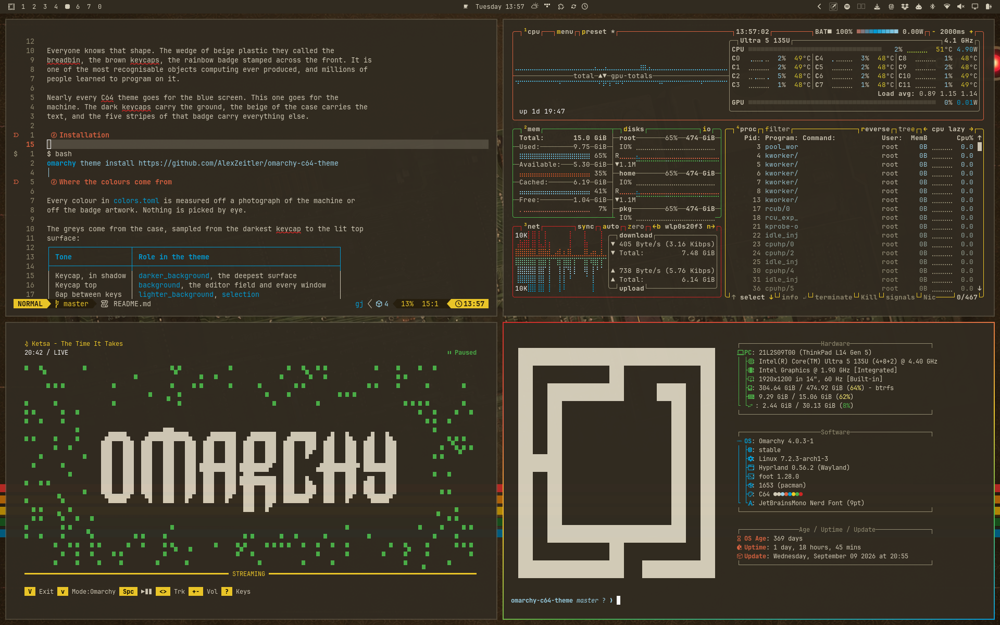
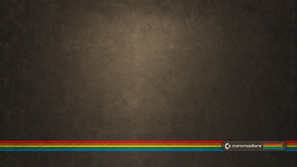
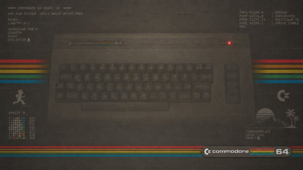
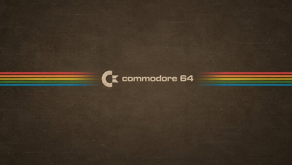
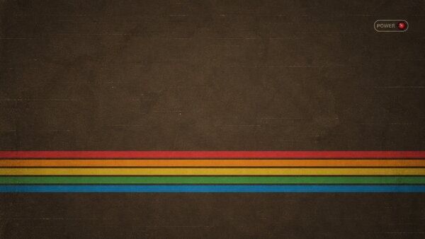
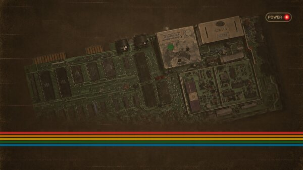
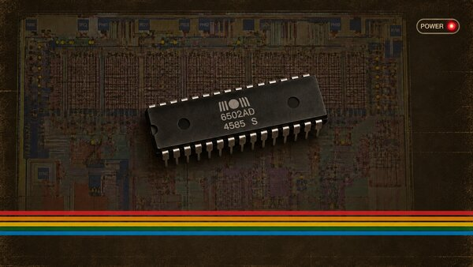

# omarchy-c64-theme



Everyone knows that shape. The wedge of beige plastic they called the
breadbin, the brown keycaps, the rainbow badge stamped across the front. It is
one of the most recognisable objects computing ever produced, and millions of
people learned to program on it.

Nearly every C64 theme goes for the blue screen. This one goes for the
machine. The dark keycaps carry the ground, the beige of the case carries the
text, and the five stripes of that badge carry everything else.

## Installation

```bash
omarchy theme install https://github.com/AlexZeitler/omarchy-c64-theme
```

## Where the colours come from

Every colour in `colors.toml` is measured off a photograph of the machine or
off the badge artwork. Nothing is picked by eye.

The greys come from the case, sampled from the darkest keycap to the lit top
surface:

| Tone              | Role in the theme                               |
|-------------------|-------------------------------------------------|
| Keycap, in shadow | `darker_background`, the deepest surface        |
| Keycap top        | `background`, the editor field and every window |
| Gap between keys  | `lighter_background`, `selection`               |
| Keyboard well     | `brown`, the inactive window border             |
| Case in shadow    | `dark_foreground`, comments                     |
| Function keys     | `muted`, dimmed text and divider lines          |
| Case top          | `foreground`, all text                          |

The chromatic slots are the five stripes of the rainbow badge, in their order
on the case:

| Slot     | Stripe    | Bright step                       |
|----------|-----------|-----------------------------------|
| `red`    | red       | the same stripe in daylight       |
| `orange` | orange    | the same stripe in daylight       |
| `yellow` | gold      | the same stripe in daylight       |
| `green`  | green     | the same stripe in daylight       |
| `blue`   | azure     | the same stripe in daylight       |

The normal step is the stripe as the printed badge shows it. The bright step
is the same stripe as a daylight photograph of the case renders it, washed out
by the light. Both are measurements of one object under two conditions.

The active window border runs all five stripes at 45 degrees. The accent is
the gold in the middle.

### Two slots the machine does not have

The badge has five stripes, so `cyan` and `magenta` have no source. They do
not carry a turquoise or a pink. The cyan slot takes the pale blue of the
stripe in daylight, the magenta slot the orange of the badge.

Both roles therefore repeat a neighbour. Syntax highlighting loses one
distinction in each pair, and `bright_blue` and `cyan` hold the same value.

## Wallpapers

Six wallpapers ship in `backgrounds/`, all at 3840 by 2160. Omarchy cycles
through them. Click a thumbnail to open the full resolution.

### The badge

The badge and its stripes along the lower edge.

[](backgrounds/01-commodore-minimal.png)

### The boot screen

The BASIC V2 boot text over the keyboard, power lamp lit.

[](backgrounds/02-basic-boot.png)

### The wordmark

Centred, with the stripes running out to both sides.

[](backgrounds/03-commodore-logo.png)

### The power lamp

Stripes across the lower third, the lamp in the top right corner.

[](backgrounds/04-power-led.png)

### The mainboard

The board seen from above, stripes along the bottom.

[](backgrounds/05-mainboard.png)

### The 6502

A 6502 resting on a die shot of itself.

[](backgrounds/06-6502.png)

## What the theme ships

The theme carries `colors.toml`, and Omarchy generates the file for every
program from it. Beyond that it ships four things Omarchy has no template for.

**`gtk.css` and `hooks/gtk`**
GTK reads `~/.config/gtk-3.0/gtk.css` and `~/.config/gtk-4.0/gtk.css` and
nothing else. The hook writes the theme's block into both files, between two
markers, and removes it again for a theme without GTK colours. Link it once:

```bash
ln -s ~/.config/omarchy/themes/c64/hooks/gtk \
  ~/.config/omarchy/hooks/theme-set.d/gtk
```

**`cliamp.toml` and `hooks/cliamp`**
The palette for the cliamp player. Its yellow slot carries the OMARCHY logo, a
block filling a quarter of the window, so that slot takes the case beige
instead of the gold.

**`fastfetch.json` and `hooks/fastfetch`**
Sets the fastfetch logo colour. The hook touches that field only and leaves
the per-module colours alone.

**`neovim.surfaces`**
A marker file, not a colour file. A theme cannot ship a `neovim.lua`: Omarchy
refuses Lua that comes out of a cloned repository. The file asks a template
under `~/.config/omarchy/themed/` for three things: floating windows on the
editor field, bounded by a frame in the accent; no coloured fill behind a
markdown heading, which render-markdown.nvim otherwise takes from the git
diff colours; and a selection that swaps the two theme colours. Without that
template the file does nothing.

## Licence

Everything in this repository is MIT licensed, the colours, the configuration
files and the wallpapers alike. See `LICENSE`.
